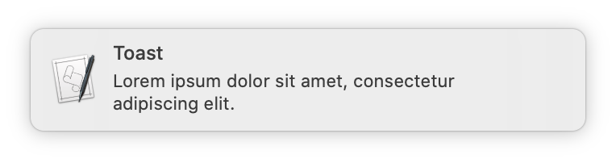
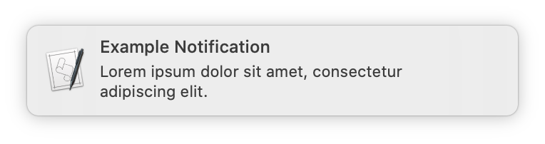
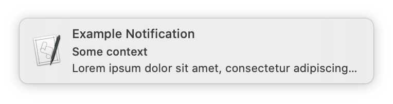

# toast
`toast` is a simple script for displaying macOS Notification Centre notifications from the command line.  It is simply a wrapper around [Apple's `osascript` command](https://support.apple.com/lt-lt/guide/terminal/trml1003/mac).

# Installation
You will need to checkout this repository and then add the `toast` script to somewhere on your `PATH`.

One way to do this as is follows:

```
git clone https://github.com/davweb/toast.git
cd toast
ln -s $PWD/toast /usr/local/bin
```

# Usage
Display a notification with the default title:

`toast Lorem ipsum dolor sit amet, consectetur adipiscing elit.`



Display a notification with a custom title:

`toast --title "Example Notification" Lorem ipsum dolor sit amet, consectetur adipiscing elit.`



Display a notification with a custom title and a subtitle:

`toast --title "Example Notification" --subtitle "Some context" Lorem ipsum dolor sit amet, consectetur adipiscing elit.`



# Options
```
usage: toast [-h] [-t TITLE] [-s SUBTITLE] text [text ...]

Show a notification in the Notification Center.

positional arguments:
  text                  the notification text

optional arguments:
  -h, --help            show this help message and exit
  -t TITLE, --title TITLE
                        title for the notification
  -s SUBTITLE, --subtitle SUBTITLE
                        subtitle for the notification
```                        

# Frequently Asked Questions
**Q.** Can I change the icon displayed on the notification?

**A.** No. This is a limitation of the `osascript` command.
